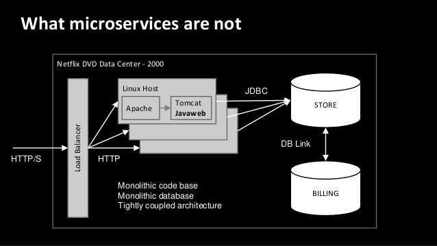

# Part 2: Container Theory

## Why use Containers?

Containers offer a logical packaging mechanism in which applications can be abstracted from the environment in which they actually run. This decoupling allows container-based applications to be deployed easily and consistently, regardless of whether the target environment is a private data center, the public cloud, or even a developer’s personal laptop. This gives developers the ability to create predictable environments that are isolated from rest of the applications and can be run anywhere.

From an operations standpoint, apart from portability containers also give more granular control over resources giving your infrastructure improved efficiency which can result in better utilization of your compute resources.

Due to these benefits, containers (& Docker) have seen widespread adoption. Companies like Google, Facebook, Netflix and Salesforce leverage containers to make large engineering teams more productive and to improve utilization of compute resources.

Some of the key uses of containers are:

* ___Development:___
  * Developing & building applications across many different host 0Ss and infrastructure
* ___Building out CI/CD pipelines:___
  * Encouraging a more productive & agile developer environment in the DevOps industry
  * Consistent container image moveing through the pipeline
  * Preventing "it worked in dev" syndrome
* ___Application Modernization & Portability:___
  * Used highly when moving application from on-prem to the cloud

In organizations that adopt Docker, deployments tend to increase steadily in scale long after the initial rollout. Deployments are also growing faster than they have in the past—the average size of a 10-month-old Docker deployment has increased 75% since last year.

### Industry examples:

Some businesses you may have heard of that have evolved from monolithic infrastructure to microservices in order to handle large volumes of data more effciently include Netflix, SoundCloud, Amazon & Twitter.

#### How Netflix Handles Microservices:

- Netflix started out with a monolithic infrastructure, where all engineers contributed to one single codebase, which would be deployed into production once a week
- This meant that trying to debug a problem was difficult and there was lack of agility in their development cycle as each component was heavily interconnected

- As they started to become more popular, handling of network traffic and diagnosing issues became harder
- They started to move away from this structure and into a more modular microservice structure in order to allow for ease in scalability and automation

For more information see [here](https://www.youtube.com/watch?v=CZ3wIuvmHeM).

Continue to [Part 3](Microservices.md)