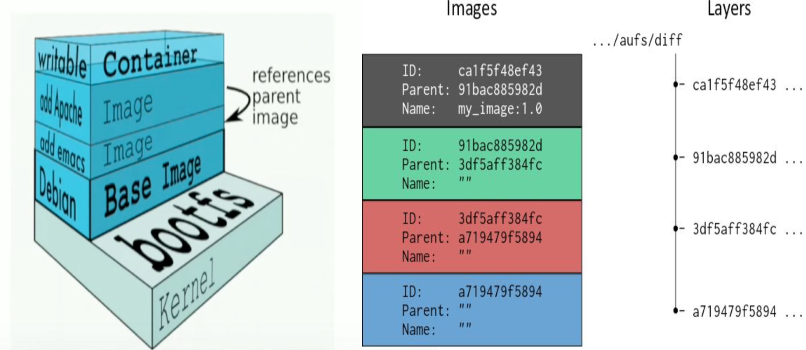

# Part 10: Layers

TODO: Docker file with layers tutorial: 
- latest image references parent image

Each container is an image with a readable/writeable layer on top of a bunch of read-only layers. These layers (also called intermediate images) are generated when the commands in the Dockerfile are executed during the Docker image build.

Layers are neat because they can be re-used by multiple images saving disk space and reducing time to build images while maintaining their integrity.

